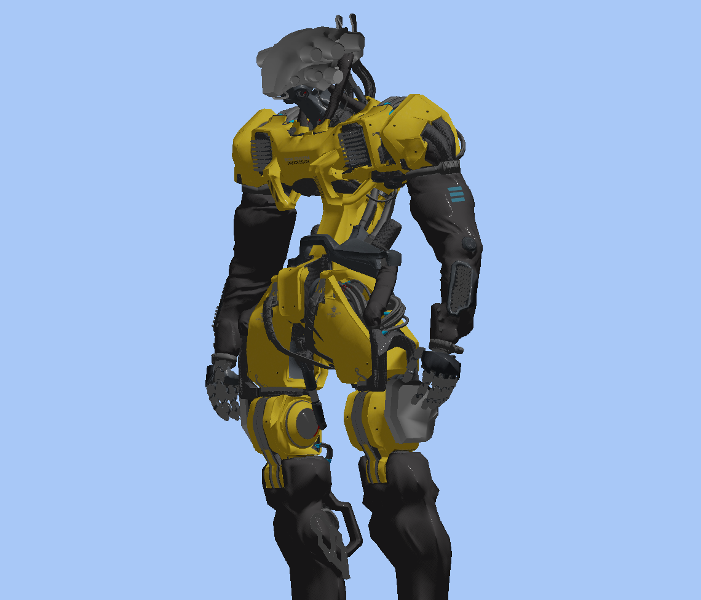

# Anim Engine

A Vulkan-based 3D engine written in modern C++20, targeting macOS (MoltenVK) and Linux.



## Features

- **PBR Rendering** - Physically-based rendering with Cook-Torrance BRDF
- **Normal Mapping** - Vertex tangent-based TBN for accurate surface detail
- **glTF Model Loading** - Full support for glTF 2.0 models with textures and materials
- **Pipeline Caching** - Efficient pipeline management and reuse
- **Dual Camera Modes** - FPS and orbit cameras with seamless switching
- **Dynamic Resize** - Swapchain recreation on window resize

## Requirements

- CMake 3.24+
- C++20 compiler (Clang or GCC)
- Vulkan SDK 1.4+
- glslc (for shader compilation)

## Build

```bash
mkdir build && cd build
cmake ..
make
```

## Usage

```bash
./anim <path-to-model.gltf>
```

### Controls

| Key/Action | FPS Mode | Orbit Mode |
|------------|----------|------------|
| WASD | Move | - |
| Space/Shift | Up/Down | - |
| Left Click + Drag | Look around | Orbit |
| Right Click + Drag | - | Pan |
| Scroll | FOV zoom | Distance zoom |
| Tab | Toggle camera mode ||
| I | Toggle wireframe ||
| ESC | Exit ||

## Dependencies

All dependencies are fetched automatically via CMake FetchContent:

- SDL3 - Windowing and input
- glm - Math library
- VulkanMemoryAllocator - GPU memory management
- tinygltf - glTF loading
